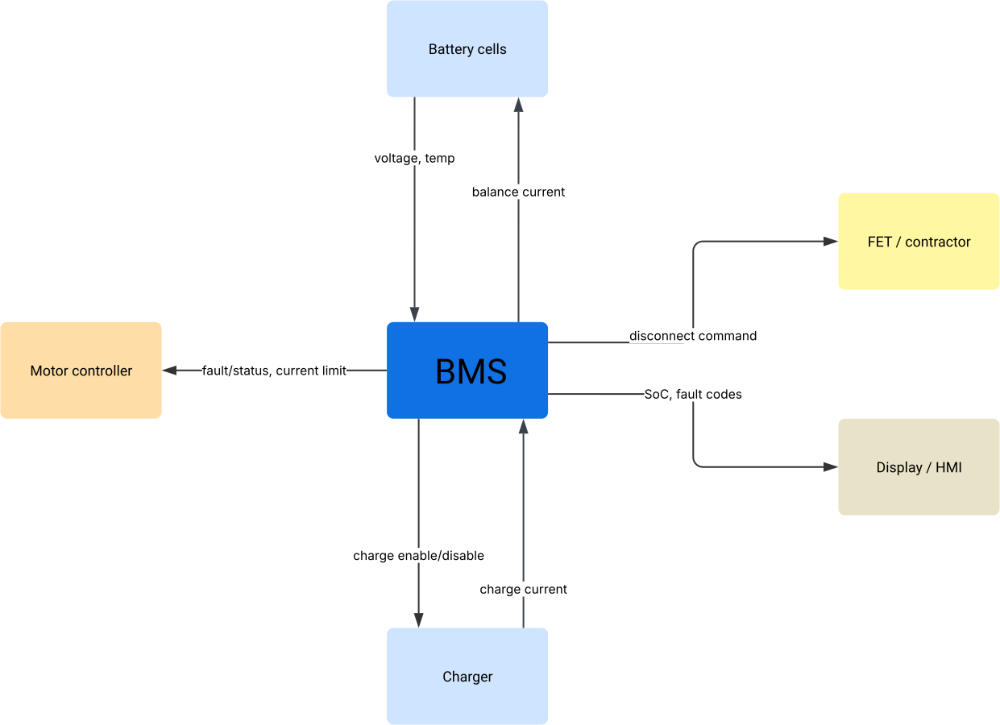

# 1. System Context

## Purpose of the system

The Battery Management System (BMS) protects, monitors, and manages the battery pack of an eBike throughout its operating life: during riding (discharge), charging, and storage. Its core responsibilities are to prevent unsafe operating conditions (overvoltage, overcurrent, over-temperature), to estimate and report the pack's state of charge, and to communicate pack status and faults to the rest of the vehicle system.

## Stakeholders

| Stakeholder | Interest |
|---|---|
| Rider | Safe, reliable power delivery; accurate range/SoC display |
| OEM / manufacturer | Product safety, regulatory compliance |
| Regulatory bodies | Compliance with applicable eBike and battery safety standards |
| Motor controller (system-level "stakeholder") | Needs trustworthy current-limit and fault signals to make its own decisions |

## System boundary

**In scope (the BMS):** cell voltage/temperature monitoring, cell balancing, protection logic (over/undervoltage, overcurrent, over-temperature), SoC estimation, power path control (FET/contactor switching), fault communication.

**Out of scope:** motor controller internals, charger internals (BMS only *interfaces* with the charger, doesn't control its internal control loop), mechanical pack enclosure, cell chemistry/manufacturing, HMI/display internal logic (BMS only sends data to it).

## External systems

| External system | Relationship to BMS |
|---|---|
| Battery cells | BMS measures voltage/temperature, controls balancing |
| Motor controller | Receives fault/status signals, current-limit info from BMS |
| Charger | BMS authorizes/terminates charging, reports charge status |
| Display / HMI | Receives SoC, fault codes for rider display |
| Power path (FETs/contactor) | BMS commands disconnect on fault |

## Context diagram

  
  *Figure 1: BMS system context: external interfaces to cells, motor controller, charger, HMI, and power path.*
