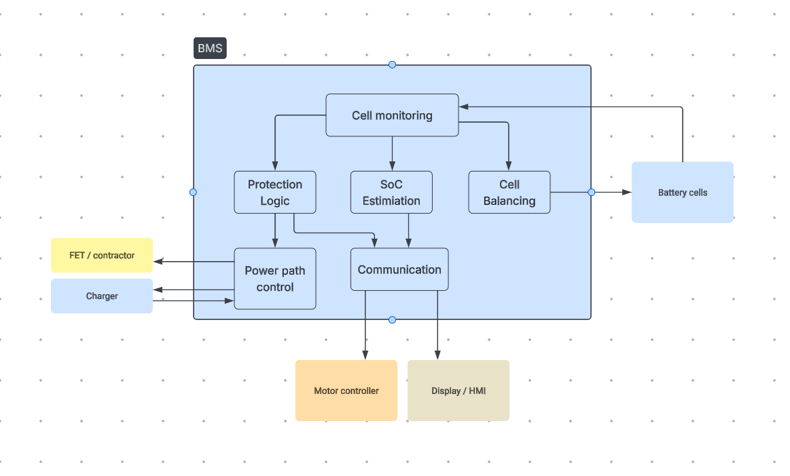

# 2. Architecture

## Functional decomposition

| Block | Responsibility |
|---|---|
| Cell Monitoring | Measures individual cell voltages and pack/cell temperatures |
| Cell Balancing | Equalizes charge across cells during charge/idle |
| Protection Logic | Evaluates monitored values against thresholds; triggers disconnect on fault (overvoltage, undervoltage, overcurrent, over-temperature) |
| SoC Estimation | Computes State of Charge from voltage/current history for display |
| Power Path Control | Drives the discharge/charge FETs or contactor based on Protection Logic commands |
| Communication | Sends status/fault data to Motor Controller and HMI |

## Architecture diagram

 

## Rationale 

- **Cell Monitoring** is the single source of truth that all other blocks depend on: kept as one block to keep the ICD simple.
- **Protection Logic** is deliberately the *only* block allowed to command Power Path Control: a single decision point for safety-critical disconnects, easier to verify than distributed logic.
- **Cell Balancing** only acts on Cell Monitoring data and never touches Protection Logic directly: balancing is a health/efficiency function, not a safety function.
- **Communication** is a shared output block (SoC + fault data) rather than each block talking externally: keeps the external interface surface (documented in `03-interfaces.md`) minimal and consistent.

## Traceability note

Each block here exists to satisfy a responsibility named in the `01-system-context.md` "In scope" list — e.g. Protection Logic + Power Path Control together implement the disconnect-on-fault responsibility that Stakeholders (rider, OEM) and the Overload Protection use case depend on.
