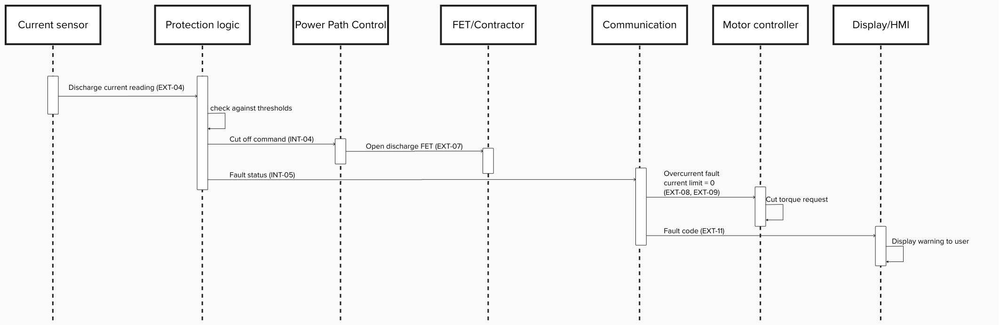

# 4. Overload Protection Use Case

## Trigger scenario

A rider climbs a steep hill in high_assist_mode. Sustained high torque demand drives discharge current above the pack's rating (20A) and toward/beyond the peak rating (35A) for longer than the system is designed to tolerate: either a sharp spike (e.g. a wiring fault or FET failure causing a near-short) or a sustained overload (e.g. an aggressive rider profile pushing the motor hard uphill).

Protection is implemented as **two speed overcurrent protection**

- **Instant shutoff**: current > 55A → power cut off within 10ms (detecting a near-short-circuit)
- **Delayed shutoff**: current > 40A sustained for >500ms → power cut off (detecting a genuine sustained overload, while tolerating brief legitimate peak-current rises up to 35A, e.g. a hard hill)

## Requirements

| ID | Requirement |
|---|---|
| REQ-OP-01 | The BMS shall continuously monitor discharge current via EXT-04. |
| REQ-OP-02 | The BMS shall cut off the discharge path within 10ms if current exceeds 55A. |
| REQ-OP-03 | The BMS shall cut off the discharge path within 500ms if current exceeds 40A continuously. |
| REQ-OP-04 | The BMS shall not cut off power for current excursions ≤35A (peak rating), to avoid false shutoffs. |
| REQ-OP-05 | Once cut off, the BMS shall report an overcurrent fault to the Motor Controller (EXT-08) and Display/HMI (EXT-11). |
| REQ-OP-06 | Once cut off, the BMS shall stay disconnected, it shall not automatically reconnect, until an explicit reset condition, to prevent rapid on/off cycling. |

## Hazard / risk analysis

Risk Priority Number = Severity × Occurrence × Detection (each rated 1–10). Detection is scored *with* the mitigating component's protection already in place, showing how much each design decision actually reduces risk.

| Failure mode | Severity | Occurrence | Detection | RPN | Mitigating component |
|---|---|---|---|---|---|
| Sustained overcurrent (cell/wiring heating, possible thermal event) | 8 | 5 | 2 | 80 | Protection Logic - delayed shutoff (REQ-OP-03) → Power Path Control |
| Near short circuit (rapid heating, fire risk) | 10 | 2 | 2 | 40 | Protection Logic - instant shutoff (REQ-OP-02) → Power Path Control |
| Rapid on/off cycling (FET stress, unpredictable behavior) | 5 | 3 | 3 | 45 | Protection Logic - stay off / no auto-reconnect (REQ-OP-06) |

Highest priority risk by RPN is the sustained overcurrent case (80): which is why it's the primary trigger scenario for this use case, rather than the near short circuit case, even though the latter has higher severity.

## Design response

Implements directly on the architecture and interfaces already defined: **Protection Logic** reads discharge current (EXT-04) and checks it against both thresholds. When either threshold is crossed, it commands **Power Path Control** to open the discharge FET (INT-04 → EXT-07), cutting off the power, and notifies **Communication**, which reports the fault to the Motor Controller (EXT-08, EXT-09) and Display/HMI (EXT-11). Protection Logic remains the single decision authority, consistent with the architecture that only one block is allowed to command a safety critical shutoff.

## Sequence of events

 

## Verification / test cases

| Test ID | Setup | Expected result | Pass criteria |
|---|---|---|---|
| TC-OP-01 | Apply 60A discharge current | Power cut off, fault reported | Cutoff within 10ms |
| TC-OP-02 | Apply 45A sustained for 600ms | Power cut off at ~500ms mark | Cutoff within 500ms ±50ms |
| TC-OP-03 | Apply 35A peak burst for 200ms, then drop to 15A | No shutoff (within peak rating) | Power stays on throughout |
| TC-OP-04 | After a shutoff, reduce current to 0A | Power stays off | No automatic reconnect without explicit reset |
